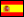

# Learning

Learning in general is a big topic in my life and it's traversal to everything.

It would be stupid to gather here everything about what I learn because that's the intent of the wiki itself. Instead, I'll focus here in keeping track of courses and other active learning steps I take.

## Courses

### Completed

I have completed many courses in the past, but I'm going to collect only new ones, so as of the time I'm starting this (Jan 2021) this list is empty.

### Next

 - [Ethical Hacking with Python](https://www.udemy.com/course/complete-ethical-hacking-bootcamp-zero-to-mastery/)

 - [Data Structures and Algorithms](https://www.udemy.com/course/master-the-coding-interview-data-structures-algorithms/)

 - [Rust Fundamentals](https://www.udemy.com/course/rust-fundamentals/)

 - [Codewars Week of SQL](http://r.news.codewars.com/mk/mr/HTOXcZ8we_vvyQ-SbmOI5pz1h4aXmRJoGXVK0ox8h1XzbFY48gcF2Ady4ZI4xBZ0GCLY1Gndo28CZA2nPimyaIzfI8nKvYb8QgF2og0Z0tyYO6Gz8u-_i0rq1W7k1J1p0CA)

## Languages

This is more or less every language I ever studied, sorted from most proefficient to least:

 -  Galician 
 -  Spanish 
 -  English 
 -  French 
 -  German 
 -  Italian 
 -  Portuguese 
 -  Catalan 
 -  Russian 
 -  Chinese 
 -  Polish 
 -  Farsi 
 -  Japanese 
 -  Danish 
 -  Afrikaans 
 -  Bulgarian 

